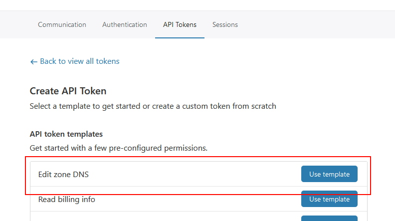

# DDNS4Me
_A Dynamic DNS Command Line tool for use with Cloudflare_


## Overview

DDNS4Me is a basic CLI tool that allows updating of Cloudflare DNS "A" Records to reflect your current public IP address.
It utilises the Cloudflare API to perform the DNS updating and [a third-party service to identify your public IP address](#Public-IP-Address-Discovery).

## Usage

#### Common Usage

```
ddns4me --auth-path cfauth.json --zone dac9630aec642a428cd73f4be0a03569 --name my.example.org
```

#### Using a custom IP provider

```
ddns4me --auth-path cfauth.json --zone dac9630aec642a428cd73f4be0a03569 --name my.example.org --ip-provider https://echo.example.org
```

#### Using a custom TTL

```
ddns4me --auth-path cfauth.json --zone dac9630aec642a428cd73f4be0a03569 --name my.example.org --ttl 360
```

## Command Line Arguments

|Argument|Description|
|-|-|
|`--auth-path`|Required. Path to the authentication file that contains the [authentication details](#Authentication).|
|`--zone`|Required. The Cloudflare Zone Identifier.|
|`--name`|Required. The DNS name to use in the zone.|
|`--ttl`|(Default: 120) The DNS record Time-to-Live (TTL) in seconds.|
|`--ip-provider`|(Default: https://icanhazip.com/) URL for service that returns your public IP as plain text.|

## Authentication

DDNS4Me requires a Cloudflare API token which needs to be stored in a JSON file to avoid the token itself being stored in shell logs.

```json
{
    "CloudflareApiToken": "3706c7ce56fa785fe0e8e09c0c4bbacd"
}
```

To create your own Cloudflare API token, head to your [account profile on Cloudflare](https://dash.cloudflare.com/profile) then to the API Tokens page.
From there, you need to create a token with the `Edit zone DNS` permission which Cloudflare has a template for.



## Public IP Address Discovery

The third-party service for public IP addresses can be any service that returns your public IP as plain text from a HTTP request.
By default, DDNS4Me will use [icanhazip.com](https://icanhazip.com/) however you can specify your own via the `--ip-provider` command line argument.

For those that have privacy concerns or would like to control the IP provider themselves, it can be a straightforward task to make your own.
Through something like [Cloudflare Workers](https://workers.cloudflare.com/), available for free, you can build your own IP provider with code similar to this example:

```javascript
addEventListener('fetch', event => {
  event.respondWith(handleRequest(event.request))
})

/**
 * Respond to the request
 * @param {Request} request
 */
async function handleRequest(request) {
  return new Response(request.headers.get("cf-connecting-ip"), {status: 200})
}
```

It is entirely possible to build your own in any language on any Internet-available service - whether that be [Azure Functions](https://azure.microsoft.com/en-us/services/functions/), [AWS Lambda](https://aws.amazon.com/lambda/) or some other hosting.
The only thing it needs to do is echo-back as plain text the IP address of the client that made the request.